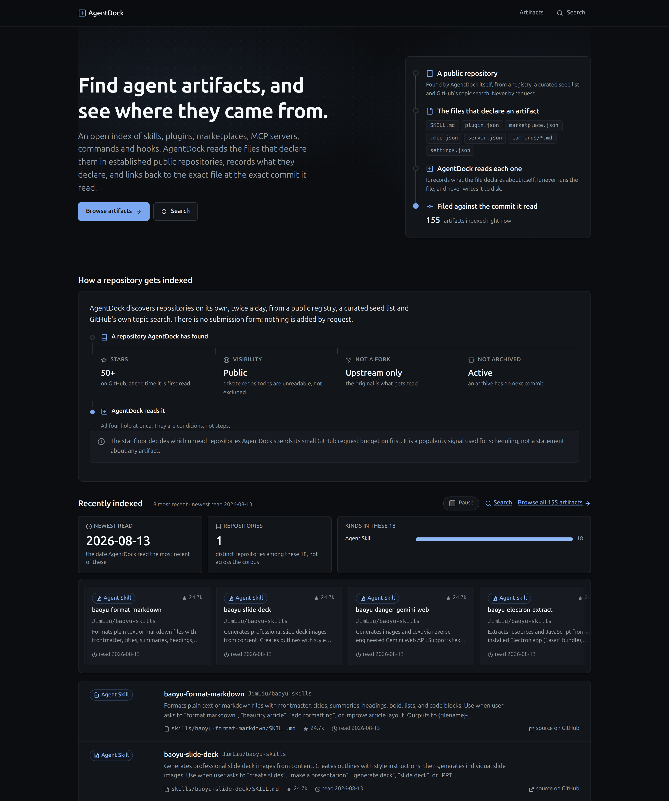
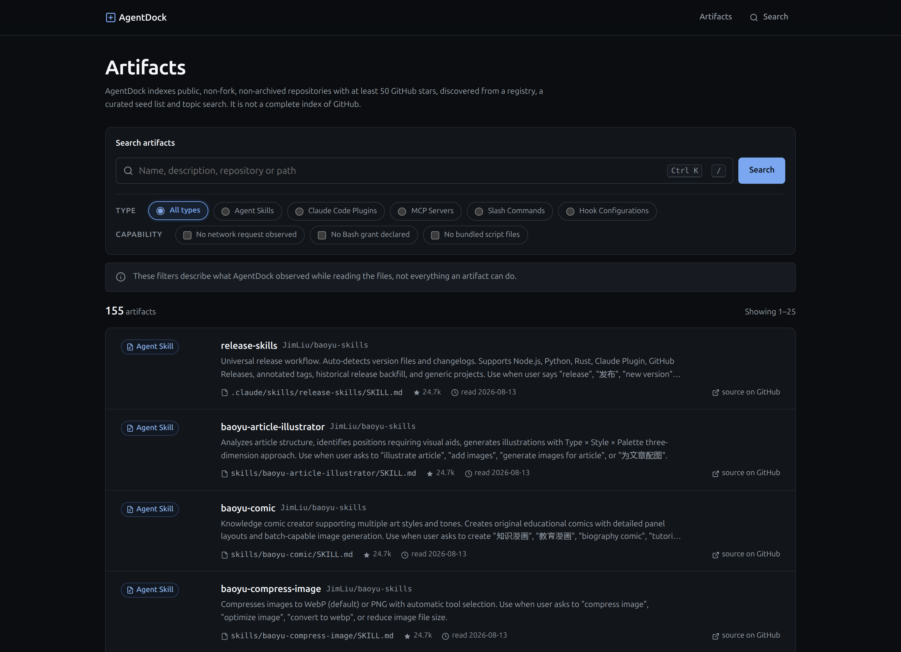

# AgentDock

[한국어](./README.md) | English

An open index of AI agent artifacts — skills, plugins, marketplaces, MCP
servers, slash commands and hooks — discovered from established public GitHub
repositories, parsed, and linked back to the exact file at the exact commit
AgentDock read.



The home page is one board: a pipeline showing what gets indexed and how, three
tiles summarising what was read most recently, a rail of recently indexed
artifacts drifting slowly past, and a list holding still everything the rail
shows. The rail carries an always-visible stop control.

Every figure on those tiles is computed from the list the page had already
fetched — there is no second query — so each is true of that window and not of
the corpus. Any tile that could be mistaken for a total says so in its own label
("in these 18"), because a number printed without its window is read as a total
by everyone who sees it.

**AgentDock reads files and reports what it read. It does not run them, and it
cannot say whether an artifact is safe.** There is no risk score, no grade and
no safety badge anywhere in the interface, by design.

## What is AgentDock?

A small, self-hostable index. It watches a set of public repositories, notices
the artifact files inside them, records what those files declare, and makes the
result searchable. That is the whole product.

It is **not** a marketplace, an installer, a package manager, or a complete
index of GitHub. Nothing is executed, nothing is mirrored, and nothing is
recommended.

Two things follow from that, and they are the reason for most of the design
decisions below:

- **The corpus is not the ecosystem.** Every result page says so. An artifact
  AgentDock has not indexed is not an artifact that does not exist.
- **Popularity is a scheduling signal, not a safety guarantee.** The star floor
  below decides which unread repositories a small request budget is spent on
  first. It says nothing about any artifact.

## Supported Artifacts

Six types, one detector each in `src/detect/`:

| Type | Recognised by |
|---|---|
| **Agent Skill** | `SKILL.md` with YAML frontmatter |
| **Claude Code Plugin** | `.claude-plugin/plugin.json`, or a directory shaped like one |
| **Plugin Marketplace** | `.claude-plugin/marketplace.json` — a catalog, which contributes repositories rather than artifacts |
| **MCP Server** | `.mcp.json`, and the MCP registry's own entries |
| **Slash Command** | a Markdown file under `.claude/commands/` |
| **Hook Configuration** | a `hooks` block in `.claude/settings.json` |

Detection is by file shape, never by repository name or topic. A repository with
none of these costs zero file reads: the tree is inspected for paths first, and
only matching paths are fetched.

## Repository Discovery Policy

A repository is added by automatic discovery when **all** of these hold:

- public
- at least **50 GitHub stars**
- not a fork
- not archived
- and it actually contains a supported artifact file

There is **no submission form**. AgentDock has no accounts, no sign-in and no
operator review, so an endpoint that let an anonymous visitor name a repository
would be an unauthenticated way to spend a shared request budget and to put
anything at all into a public index, with nobody to hold responsible for it.
Discovery is entirely automatic, from a public registry, a curated seed list,
curated link lists and GitHub's own topic search.

The star floor lives in exactly one place, `src/corpus/policy.ts`, and everything
else — the topic sweep's own floor, the messages, the UI copy — reads it from
there.

**It is an entry gate, not a deletion rule.** A repository whose stars later fall
below the floor keeps every artifact it contributed and keeps being re-read on
the ordinary schedule. Removing artifacts because a repository became less
popular would be a trust score wearing a different hat, and
`src/db/queries/search.ts` consults the floor for nothing — a test asserts the
complete list of modules allowed to import it.

**The floor is not a quality score and not a ranking input.** It answers one
question only: given a budget of 60 GitHub requests an hour, which of the
repositories nobody has looked at yet should be read first? Search results are
never ordered by stars, and no artifact is ranked above another because its
repository is popular.

## How a Repository Gets Indexed

```
      registry            seed list         curated lists       topic search
   (MCP registry)      (config/seeds)     (awesome-*.md)     (GitHub search API)
          │                   │                  │                   │
          └───────────────────┴────────┬─────────┴───────────────────┘
                                       ▼
                                   repo_seed                 no GitHub core cost
                                       │
                                       ▼
                                  ingest_job                 the queue
                                       │
                                       ▼
                          ┌───────────────────────┐
                          │  metadata + tree      │          2 core requests
                          ├───────────────────────┤
                          │  discovery gate       │  ──────► declined: stop here
                          ├───────────────────────┤
                          │  commit sha unchanged?│  ──────► unchanged: stop here
                          ├───────────────────────┤
                          │  detect → fetch files │          raw host, no quota
                          │  → parse → analyze    │
                          └───────────┬───────────┘
                                      ▼
                          package / package_version /
                          capability_finding  ──────────────► search, browse
```

Both gates sit above the expensive part. A declined repository and an unchanged
one each cost two core requests and **zero** file reads, against the up-to-400
raw fetches and two minutes of wall clock a full read can take.

## Scheduled Synchronization

**The web server does not ingest.** `docker compose up`, a restart, a crash
recovery and a rollback all issue zero GitHub requests. There is no in-process
worker and no `INGEST_WORKER` flag — the poll loop that used to start at boot was
deleted rather than defaulted off, because a flag would leave the coupling one
environment variable away from returning.

Ingestion is one command, which cron runs **twice a day** and which exits:

```bash
bun run sync
```

It discovers from every source, re-checks stored repositories whose last read is
older than twelve hours (least-recently-read first, so the corpus rotates rather
than starving its tail), drains the queue, and prints a summary:

```
AgentDock scheduled sync

  Repositories processed        12
    ingested (new or changed)   11
    unchanged, no files read     0
    no artifacts found           0

  Declined by discovery policy   0
    below 50 stars               0
    archived on GitHub           0
    a fork                       0

  Could not be read              0
  Rate limited, deferred         1
  Other failures                 0

  GitHub core requests left      0 of 60
  Duration                      94s
```

Every cap prints what it dropped. A run that stops on an exhausted budget says
how much of the cap it left unspent; a refresh pass that could not reach every
stale repository says how many it left behind. A cap that prints nothing reads
as "we covered everything".

### Incremental refresh, by commit SHA

A repository whose default branch has not moved since the last read
short-circuits **before a single file is fetched**: the commit SHA that arrives
with the tree response is compared against the stored `last_ingested_sha`, and a
match ends the run at two core requests and zero raw fetches.

Running the sync twice in a row therefore reads almost nothing the second time —
which is the property the twice-daily schedule depends on.

Re-checking is scheduled on `scanned_at`, oldest first, so a corpus larger than
one run's cap rotates through itself rather than starving its tail. Forks and
archived repositories are skipped by the refresh pass — an archive has no next
commit — but nothing is deleted, and **stars are not consulted at all**.

## Search / Browse



- **Full text** over name, summary, path and type, weighted A→D, in a
  PostgreSQL generated `tsvector` column maintained by the database.
- **Typo tolerance** — when full text finds nothing, a trigram pass over name and
  summary offers close matches, labelled as close matches and never as exact
  ones.
- **Filters** by artifact type and by capability observation, applied in SQL
  inside the same predicate the count uses.
- **URL as state.** Query, filters and page are all in the address bar, the form
  is a plain GET with native controls, and the whole page works with JavaScript
  disabled.
- **Keyboard.** `/` and Ctrl/Cmd+K put the cursor in the search field. On a page
  that has the field they focus it and select the query, so the next keystroke
  replaces it; on a page that does not, a small launcher opens as a native
  `<dialog>` — Escape closes it, and a query submits straight to the search
  page. It is not a second search implementation: the launcher sends the same
  `q` to the same route with the same GET. The type chips inside the launcher
  are likewise plain `/artifacts?type=…` links — the same URL the search form
  produces. The key hints drawn inside the search field appear only while
  JavaScript is actually running, and name the modifier the reader has (`⌘K` or
  `Ctrl K`): every shortcut here is bound by that script, so nothing advertises
  a key that would do nothing.
- **Artifact type is carried on three channels** — a glyph, a word and a hue —
  so type is never signalled by colour alone and any one of the three is enough.
- **Permalinks.** Every artifact has a stable URL, and every "source on GitHub"
  link points at the commit SHA AgentDock actually read — never at a branch,
  which would drift.

Capability filters narrow results; they are never a ranking input. Neither are
stars, downloads, or anything else about a repository's popularity.

## Architecture

```
Next.js 16 (App Router, all routes force-dynamic, three client components)
        │
        └── PostgreSQL 16          the only datastore. No cache, no queue
             ├── search: tsvector + GIN, pg_trgm for typo tolerance
             └── the ingest queue: SELECT … FOR UPDATE SKIP LOCKED
```

There is no Redis, no OpenSearch, no vector database and no message broker. The
queue is a table, the scheduler is cron, and the lock manager is PostgreSQL.

The front end is the same shape. Every page is a Server Component rendering
plain CSS with custom properties — no UI kit, no CSS framework, no animation
library and no icon package. Three components carry `'use client'`, none of
them holds data or fetches anything: a polling effect on the job page, a
keyboard shortcut that puts the cursor in the search field (`/`, or Ctrl/Cmd+K),
and the error boundary, which the framework requires to be a client component.
Search, filtering and pagination are a GET form with native controls, so they
work with JavaScript disabled.

So is the motion. The index-flow diagram on the home page, the rail of recently
indexed cards drifting past under it, the order a list arrives in, and every
hover and focus response are CSS — the diagram is HTML and CSS rather than an
SVG asset, and there is no scroll observer anywhere. Every keyframe animation is
declared inside one `prefers-reduced-motion: no-preference` block, so for a
reader who asked for less motion there is nothing left to switch off: it is
never declared.

The rail moves on its own, so it carries an **always-visible stop control**
(WCAG 2.2.2). Hover and focus stop it too, but neither is what makes it
conformant — an interaction a reader never performs is not a mechanism they
have. On a touch pointer and under reduced motion the rail does not move at
all: it is a scroll-snapping carousel, and the stop control is not shown,
because there is nothing to stop.

```
src/
  app/          pages only — no server functions, deliberately
    artifacts/                   browse and search
    jobs/[id]/                   one ingest run, read-only
    r/[owner]/[repo]/            a repository and what AgentDock lists for it
    r/[owner]/[repo]/[...path]/  one artifact: every field, and the permalink
  components/   the sanitizing Markdown renderer, listing rows, inline icons
  corpus/       policy.ts (the discovery gate), caps.ts (every acquisition
                bound), refresh.ts (which stored repository to re-check),
                fanout.ts, seedList.ts, links.ts, search.ts
  db/           schema, connection, and the read queries the pages use
  detect/       six detectors, tolerant frontmatter parsing, capped JSON parsing
  analyze/      capability observation — what a file references, never a verdict
  github/       the HTTP client, metadata, tree and raw reads
  ingest/       pipeline.ts (the whole path), persist.ts (the one transaction),
                errors.ts (everything a person can be told), retry.ts (the delay
                curve and the per-outcome disposition), worker.ts (one job)
  proxy.ts      the per-request nonce and the Content-Security-Policy
scripts/        migrate, sync, corpus reset, boundary scan, fixture capture
fixtures/       frozen GitHub responses and hand-written hostile inputs
```

## Local Development

```bash
cp .env.example .env      # fill in the password you chose during bootstrap
bun install
bun run db:migrate
bun run dev               # http://localhost:3000
```

`bun run dev` refuses to start unless it is connected as a role whose
`search_path` is confined to a schema AgentDock owns.

Nothing is indexed yet, and the dev server will not index anything. To fill it:

```bash
# Frozen fixtures, no network at all. Four real repositories, pinned to a SHA.
bun run db:seed
bun run db:seed baoyu-skills

# Or the real thing, bounded. ~25 repositories and 50 of 60 core requests.
bun run sync
```

`db:seed` runs the **real** pipeline with `fetch` replaced by a fixture reader,
so seeded rows are exactly what a live ingest would produce.

## Database

AgentDock is built to share a PostgreSQL server with something else. It owns two
schemas — `agentdock` and `agentdock_test` — and holds no privilege on anything
outside them.

```bash
# Once, as a superuser. Read it first.
psql -U <superuser> -d <database> -v ON_ERROR_STOP=1 -f scripts/sql/bootstrap-agentdock.sql
psql -U <superuser> -d <database> -c '\password agentdock_app'
```

`\password` prompts without echo and sends only a SCRAM verifier, so the
plaintext never reaches a file, a command line or a server log.

- Rollback: `scripts/sql/rollback-agentdock.sql`
- Proof the boundary holds: `scripts/sql/verify-isolation.sql`

Search's typo tolerance needs `pg_trgm`. AgentDock never installs it — the
migration that uses it opens with a guard that fails loudly, naming the exact
command, if it is missing:

```sql
CREATE EXTENSION IF NOT EXISTS pg_trgm SCHEMA public;   -- superuser, once
```

### Why `scripts/migrate.mjs` and not `drizzle-kit migrate`

Both drizzle-kit and drizzle-orm's own migrator begin with
`CREATE SCHEMA IF NOT EXISTS`. PostgreSQL checks `CREATE` on the *database*
before checking whether the schema already exists, so that statement fails with
`42501` for a role that is `NOCREATEDB` and holds no `CREATE` on the database —
which is exactly what AgentDock's role is, on purpose.

Granting that privilege would hand AgentDock the ability to create schemas in a
database it shares. So `scripts/migrate.mjs` reuses drizzle's own migration
reader and history-table format — same files, same hashes, same
`__drizzle_migrations` columns — and omits the one statement the role cannot
run. Switching back later needs no data change. `drizzle-kit generate` is
untouched; it is offline and opens no connection.

## Docker Deployment

Four Compose services. Only the first one runs continuously; the other three are
one-shots behind the `tools` profile, so `docker compose up` cannot start them.

| Service | Profile | What it is |
|---|---|---|
| `agentdock` | — | the web container: SSR, browse, search |
| `sync` | `tools` | the scheduled ingest, from cron |
| `migrate` | `tools` | apply migrations, before a new image |
| `corpus-reset` | `tools` | empty the corpus; gated, almost never |

```bash
cp .env.example .env.production      # add AGENTDOCK_PORT
docker compose --env-file .env.production --profile tools run --rm migrate
docker compose --env-file .env.production build agentdock
docker compose --env-file .env.production up -d agentdock
```

`--env-file` is not optional. A service's `env_file:` is injected into the
container but is *not* read when Compose interpolates `${AGENTDOCK_PORT}` in the
`ports:` mapping — only Compose's own env file is, and this repository ships no
`.env`. Omitting the flag fails loudly, which is the intended behaviour rather
than a silent default port.

`AGENTDOCK_PORT` has no default deliberately, so it cannot silently take a port
another service on the host wants.

See [DEPLOY.md](DEPLOY.md) for the full runbook, including the one-time corpus
reset and cron registration.

## Cron Setup

Twice a day, twelve hours apart — which is what makes the schedule and the
twelve-hour staleness cutoff agree:

```cron
0 3,15 * * * cd /path/to/agentdock && docker compose --env-file .env.production --profile tools run --rm sync >> /var/log/agentdock-sync.log 2>&1
```

Replace `/path/to/agentdock` with wherever you deployed it, and note that the
times are the server's local timezone. Do not add a systemd timer as well: two
schedulers running the same one-shot is how a 60-requests-an-hour budget gets
spent twice.

## Testing

```bash
bun run ci     # boundary scan, lint, type-check, tests — exactly what CI runs
```

**No test opens a socket.** `fixtures/` holds frozen GitHub responses for four
real repositories pinned to a commit SHA, plus hand-written hostile inputs
(`adversarial/`, `xss/`), and the whole suite runs against those bytes.

Database-backed suites use the `agentdock_test` schema and skip visibly when
there is no `DATABASE_URL`, so CI stays green without a database while a local
run exercises the real queries.

```bash
bun run db:test:setup     # build agentdock_test (DDL only — deletes nothing)
bun run db:test:reset     # empty it (the schema name is a literal in the script)
```

Vitest runs test **files in parallel** against that one schema, so a
database-backed suite keys its rows on a sentinel no other suite can produce.

## Commands

| Command | What it does |
|---|---|
| `bun run dev` | Development server. Starts no ingestion. |
| `bun run build` / `bun run start` | Production build and serve. The build needs no database. |
| `bun run sync` | **The scheduled job.** Discover, refresh, drain, summarize. |
| `bun run corpus:sync --source=…` | The same machinery with sources and caps exposed, for filling an index by hand |
| `bun run corpus:reset --confirm` | Empty the corpus. Refuses unless `AGENTDOCK_ALLOW_CORPUS_RESET=1` as well. Drops nothing. |
| `bun run ci` | Boundary scan, lint, type-check, tests |
| `bun run test` | Vitest. Note the `run`: bare `bun test` invokes Bun's own runner, which hangs on these files. |
| `bun run lint` / `bun run format` | Biome, check and write |
| `bun run typecheck` | `tsc --noEmit` |
| `bun run check:boundaries` | The migration and source boundary scan |
| `bun run db:generate` | Generate a migration from `src/db/schema.ts`. Offline. |
| `bun run db:migrate` | Apply the reviewed migrations in `drizzle/` |
| `bun run db:seed [fixture]` | Ingest a frozen fixture through the real pipeline |
| `bun run db:reset --confirm` | Drop every table in `agentdock` (development only) |
| `bun run db:test:setup` / `db:test:reset` | Build / empty the test schema |
| `bun run fixtures:capture` | Re-pin the fixture corpus from GitHub |
| `bun run analyze:backfill [limit]` | Re-run the capability analyzers over stored bytes. Issues no GitHub request. |

There is deliberately no `db:push` and no `db:pull`. Those are the only migration
commands that diff live database state, and this database may hold another
application's data; `bun run check:boundaries` fails the build if such a script
ever appears.

CI runs `bun run build` and then `bun run ci` — the same commands you run, so the
two cannot drift. The build comes first because it regenerates a type
declaration the linter then reads.

## Security Considerations

**AgentDock does not tell you whether an artifact is safe.** It reads files and
reports what it read.

What it does say is what it *observed* while reading, in a vocabulary of
observation rather than judgement:

- *No network request observed*
- *No Bash grant declared*
- *No bundled script files*

Each of those describes what AgentDock looked at, not everything an artifact can
do. The interface says so on every page that shows one. Null and empty are kept
distinct throughout: an artifact analysed and found to declare nothing reads
differently from one nothing has analysed.

Five structural rules are enforced by `bun run check:boundaries` on every
non-test file under `src/`, because each is a requirement that can be enforced
rather than remembered:

| Rule | Fails on | What it protects |
|---|---|---|
| `no-raw-html` | `rehype-raw`, `dangerouslySetInnerHTML`, `allowDangerousHtml` | Untrusted Markdown is never parsed into markup. HTML in a skill body is a text node. |
| `no-execution` | `child_process`, `execSync`, `spawnSync`, `node:vm` | Nothing from a scanned repository is ever run. |
| `no-disk-write` | `writeFileSync`, `createWriteStream`, `mkdirSync`, … | Repository content never reaches disk, which removes archive extraction and path traversal by construction. |
| `no-host-sprawl` | a GitHub hostname named outside `src/github/` | `git grep` answers "what can this reach" completely. Every URL is built from two validated parts. |
| `no-verdict-vocabulary` | *safe*, *clean*, *verified*, *trusted*, *approved*, *malicious*, *grade*, *risk score* in UI copy | No page ever renders a safety verdict. |

The 50-star floor is **not** part of this. It is a scheduling rule about a
request budget and buys no assurance about anything it admits.

Every artifact body is stored as a capped excerpt with attribution, never as a
mirror, and every rendered body goes through a sanitizing Markdown pipeline.

## Limitations

- **The corpus is small and deliberately bounded.** Every acquisition source has
  a cap, and every cap prints what it dropped.
- **Unauthenticated GitHub is 60 requests an hour**, two per repository — about
  thirty repositories an hour, which is the real limit on how fast the index can
  grow. `GITHUB_TOKEN` raises it to 5,000 and needs no scopes.
- **A large repository is read partially.** 400 files per pass, 120 seconds of
  wall clock. A repository cut short says so on its own page, and nothing is
  delisted from an incomplete read — a partial read is not evidence of absence.
- **Capability observation is not analysis.** It reads a file's declared
  frontmatter and its text; it does not resolve imports, follow references or
  execute anything.
- **Search is PostgreSQL full text plus trigrams.** No embeddings, no semantic
  search, no ranking by anything but text relevance.
- **Ordering is by recency, not quality.** There is no "most starred" sort, and
  adding one would need a deliberate decision about what it means.

## Development Workflow

See [CLAUDE.md](CLAUDE.md) for the working agreement and [AGENTS.md](AGENTS.md)
for the invariants. In short: read the source before changing it, keep the diff
narrow, add a regression test for anything that was a bug, and run `bun run ci`
and `bun run build` before calling it done.
